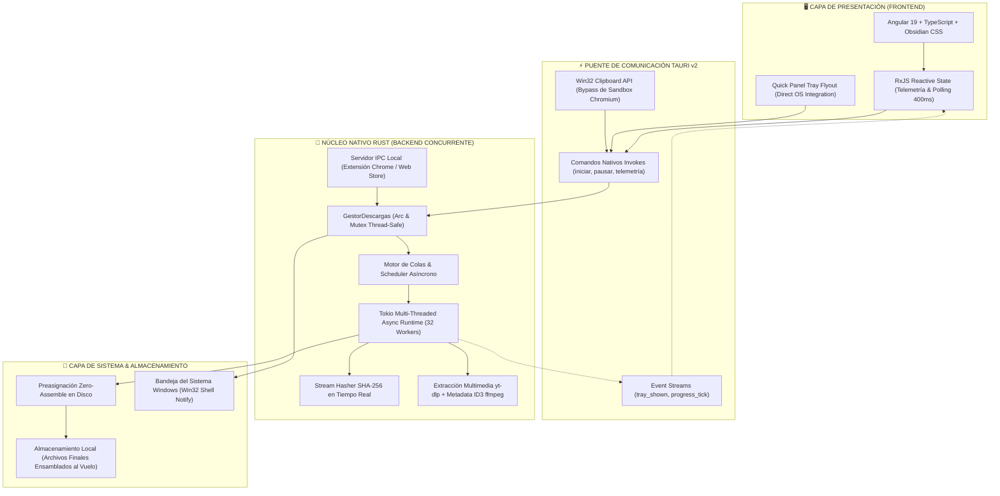

<div align="center">

# 🚀 ANDROMEDA DOWNLOAD SUITE
### *The Next-Gen Asynchronous Multi-Socket HTTP Range Download Engine*

[](https://www.rust-lang.org/)
[](https://tauri.app/)
[](https://angular.io/)
[](https://www.typescriptlang.org/)
[](https://opensource.org/licenses/MIT)

<br/>


<p align="center">
  <b>Andromeda Download Suite</b> es un acelerador de descargas de alta gama para Windows y plataformas cruzadas.
  Combina un motor en segundo plano desarrollado en <b>Rust Tokio Asynchronous I/O</b> capaz de multiplexar hasta <b>32 sockets TCP concurrentes</b> con preasignación de disco y ensamblado directo en memoria (Zero-Assemble Direct I/O), integrado a una interfaz moderna y reactiva construida en <b>Angular y Tauri v2</b>.
</p>

[✨ Características](#-características-principales) •
[🏗️ Arquitectura](#-arquitectura-del-sistema) •
[⚡ Atajos de Teclado](#-atajos-de-teclado) •
[🛠️ Instalación y Compilación](#️-instalación-y-compilación) •
[☕ Donaciones y Apoyo](#-donaciones-y-apoyo) •
[👨‍💻 Autor](#-desarrollador--autor)

---

</div>

## 🌟 Características Principales

- **⚡ Motor Tokio Multi-Socket Ultra Acelerado:** Divide dinámicamente cualquier archivo en hasta 32 fragmentos paralelos mediante cabeceras `HTTP Range 206`, saturando de forma balanceada el ancho de banda disponible.
- **💾 Zero-Assemble Direct I/O:** Preasignación de espacio en disco en bloques contiguos. Elimina la sobrecarga de re-ensamblar archivos al finalizar la descarga.
- **🎬 Gestor de Medios & Listas de Reproducción (Playlists):** Inspección remota inteligente de YouTube y plataformas multimedia con selector de calidades (1080p, 720p, 480p, Audio MP3/M4A), carrusel interactivo 3D y **embebido automático de portada/metadata ID3** en audios.
- **📊 Telemetría en Tiempo Real (Speed Duel ROI):** Muestra analíticamente el multiplicador de velocidad y el tiempo neto ahorrado frente a las descargas estándar de navegadores.
- **🎨 Sistema Dual de Temas Avanzado:** Motor de estilos con soporte para *Obsidian Dark*, *Deep Black (OLED)*, *Light* y *Pure White* sin destellos ni artefactos.
- **🛡️ Verificación Criptográfica Continua:** Cálculo en tiempo real de hashes **SHA-256** mediante streaming directo para garantizar la integridad absoluta de cada archivo descargado.
- **🔔 Quick Tray Panel & Integración con Windows:** Panel rápido en la bandeja del sistema de Windows para control ágil de descargas, pausado masivo y monitoreo en vivo sin ocupar espacio en pantalla.
- **🌐 Servidor IPC & Extensión Web:** Servidor local seguro en puerto dedicado para interceptar y transferir descargas desde el navegador en un clic.

---

## 🏗️ Arquitectura del Sistema

Andromeda Download Suite implementa un diseño desacoplado de alto rendimiento donde el frontend reactivo delega las operaciones intensivas de I/O a un motor nativo multi-hilo en Rust a través de IPC binario.



### Principios de Ingeniería Clave:
1. **Zero-Assemble Pre-Allocation:** Preasignación de bloques de archivo antes de iniciar la transferencia. Cada hilo escribe directamente en su offset sin requerir uniones temporales que dupliquen el uso de disco.
2. **Win32 Direct Clipboard Integration:** Lectura y escritura directa del portapapeles de Windows a nivel del kernel mediante `arboard`, esquivando el sandbox de WebView2 y eliminando cualquier diálogo de permisos del navegador.
3. **Pipeline Multimedia Asíncrono:** Embebido automático de carátulas de alta resolución y metadatos ID3 en archivos de audio (MP3/M4A) vía `yt-dlp` y `ffmpeg`.
4. **Sincronización Tray Flyout:** Comunicación en microsegundos entre la bandeja de Windows y la ventana flotante rápida mediante eventos reactivos nativos.

---

## ⚡ Atajos de Teclado

| Atajo | Acción | Ámbito |
| :--- | :--- | :--- |
| <kbd>Ctrl</kbd> + <kbd>N</kbd> | Abrir formulario de **Nueva Descarga** | Global |
| <kbd>Ctrl</kbd> + <kbd>A</kbd> | **Seleccionar todas** las descargas de la lista activa | Tabla Principal |
| <kbd>Supr</kbd> / <kbd>Delete</kbd> | **Eliminar** descargas seleccionadas (con confirmación y notificación) | Tabla Principal |
| <kbd>Ctrl</kbd> + <kbd>F</kbd> | Interceptado y anulado para evitar buscadores de página | Global |
| <kbd>Ctrl</kbd> + <kbd>V</kbd> | Pegar nativo vía Windows API (sin alertas del navegador) | Campos de Texto |

---

## 🛠️ Instalación y Compilación

### Requisitos Previos
- **Node.js** 18+ y **npm**
- **Rust** 1.77+ con `cargo` instalado
- Herramientas de C++ de Visual Studio (MSVC Build Tools)
- **Python** 3.10+ y `yt-dlp` (para descargas multimedia avanzadas)

### Pasos de Construcción

```bash
# 1. Clonar el repositorio
git clone https://github.com/lozp1/AndromedaDownload.git
cd AndromedaDownload

# 2. Instalar dependencias del frontend
npm install

# 3. Compilar el frontend en Angular
npm run build

# 4. Compilar el binario nativo en modo Release con Tauri / Cargo
cargo build --release --manifest-path src-tauri/Cargo.toml

# El ejecutable optimizado se encontrará en:
# release/andromeda_download.exe
```

---

## ☕ Donaciones y Apoyo

Andromeda Download Suite es un proyecto desarrollado con dedicación para brindar una alternativa moderna, rápida y sin publicidad a los gestores de descargas tradicionales.

Si esta herramienta te ha sido de utilidad para tu trabajo o estudio, considera apoyar su desarrollo continuo:

- ⭐ **Dale una Estrella al Repositorio en GitHub:** Ayuda a que el proyecto llegue a más personas.
- 💖 **GitHub Sponsors:** [github.com/sponsors/lozp1](https://github.com/sponsors/lozp1)
- ☕ **Buy Me a Coffee:** [buymeacoffee.com/francolopez](https://buymeacoffee.com)
- 💳 **PayPal:** [paypal.me/francopaololg](https://paypal.me)

---

## 📄 Licencia

Este proyecto está bajo la Licencia **MIT** - consulta el archivo [LICENSE](LICENSE) para más detalles.
Andromeda Download Suite © 2026. Todos los derechos reservados.
