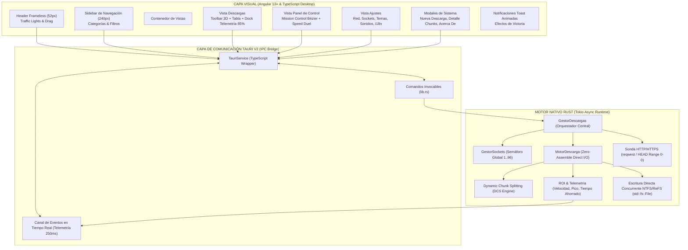

# 🛰️ ANDROMEDA DOWNLOAD — PRD MAESTRO DE ARQUITECTURA, TELEMETRÍA Y SISTEMA
**Versión de Especificación:** 3.0.0 Global Unificada  
**Estado:** Documento Rector Vivo de Producción  
**Autor & Tech Lead:** Franco Paolo López Gálvez ([francopaolo_lg@outlook.com](mailto:francopaolo_lg@outlook.com))  
**Repositorio Oficial:** [GitHub lozp1](https://github.com/lozp1)  
**Entorno de Ejecución:** Windows 10/11 Desktop Nativo (Microsoft Store MSIX)  
**Stack Tecnológico:** Rust / Tokio / Tauri v2 Core (Motor Nativo) + Angular 13+ / TypeScript (Frontend Desktop)  
**Ubicación del Proyecto Activo:** `C:\Projects\angular\AndromedaDownload`  

---

## 1. VISIÓN DEL PRODUCTO Y PROPUESTA DE VALOR ÚNICA (UVP)

La inmensa mayoría de los gestores de descargas en el mercado (creados hace 15 o 20 años) poseen interfaces saturadas, opacas y hablan en un lenguaje técnico impersonal (*"buffers"*, *"TCP flags"*, *"KB/s"*).

**ANDROMEDA DOWNLOAD** redefine la categoría bajo una premisa fundamental:
> *"A las personas no les interesan los bytes por segundo; les importa su tiempo de vida recuperado."*

### 1.1 El Problema Fundamental de las Descargas Web Monohilo
1. **Límites de Ventana TCP (BDP - Bandwidth Delay Product):** El protocolo de descarga estándar de navegadores (Chrome, Edge, Firefox, Safari) utiliza una **única conexión TCP (Monohilo)**. La latencia acumulada y los algoritmos de congestión estándar estrangulan el ancho de banda real a una fracción de la velocidad contratada.
2. **Throttling y QoS por Servidor CDN:** Los servidores de alojamiento comúnmente aplican un tope por socket a ~2.5 MB/s o 5.0 MB/s.
3. **Fragmentación y Reensamblaje Tardío:** Los gestores convencionales crean archivos `.part` temporales que, al llegar al 100%, congelan la máquina durante minutos mientras copian y unen los segmentos en disco.
4. **Falta de Feedback Industrial:** Cero métricas de salud de sockets, fluctuación de latencia o cuantificación tangible de tiempo ahorrado.

### 1.2 La Solución Andromeda
Andromeda reemplaza el modelo monohilo por un **Motor Nativo en Rust (Tokio Asíncrono)** y una interfaz modular en **Angular**:
- **Zero-Assemble Direct I/O:** Preasignación instantánea del archivo final con `set_len` (`SetFileInformationByHandle` en Windows). Sin archivos temporales `.part` ni fragmentación en NTFS/ReFS.
- **Multiplex TCP Direct I/O (1 a 32 Sockets Paralelos):** Peticiones concurrentes con cabeceras `Range: bytes=start-end`. Cada hilo escribe en su offset en disco en paralelo mediante `SeekFrom::Start`.
- **Dynamic Chunk Splitting (DCS):** Monitoreo continuo de caudal; si un socket sufre congestión o caída, el motor divide el segmento pendiente más grande y reasigna un socket nuevo.
- **Mission Control & ROI Telemetry:** Cálculo matemático continuo de tiempo de vida recuperado frente a la descarga estándar del navegador.

---

## 2. METODOLOGÍA: SPEC-DRIVEN DEVELOPMENT (SDD)

El desarrollo del proyecto se rige por **Spec-Driven Development**:
1. **Contrato de Interfaz Inmutable (RPC/IPC):** La comunicación Frontend Angular $\leftrightarrow$ Backend Rust está tipada de extremo a extremo mediante DTOs serializables en JSON (`serde::Serialize` / `serde::Deserialize` en Rust e interfaces TypeScript en Angular).
2. **Desacoplamiento Estricto UI / Motor:** La capa visual no contiene lógica de red ni I/O directo. Es un visualizador de telemetría reactivo de alta fidelidad y un emisor de comandos atómicos.
3. **Calibración Visual 1:1:** Cada componente gráfico proviene de especificaciones dimensionales exactas originadas en Qt Designer (`.ui`), garantizando ergonomía de escritorio nativa sin sensación de "página web empaquetada".

---

## 3. DIAGRAMA ARQUITECTÓNICO INTEGRAL

---

## 4. LOS 9 PILARES DEL SISTEMA EN DETALLE

### Pilar 1: ROI Visual — Tiempo Ahorrado al Usuario
- **Concepto:** Convertir la velocidad técnica en una métrica humana y gratificante.
- **Fórmulas Matemáticas:**
  $$\text{Tiempo Base (Navegador)} = \frac{\text{Bytes Totales}}{\text{Velocidad Base Estimada (2.5 MB/s)}}$$
  $$\text{Tiempo Andromeda (Turbo)} = \frac{\text{Bytes Totales}}{\text{Velocidad Real Medida}}$$
  $$\text{Tiempo Recuperado (ROI)} = \text{Tiempo Base} - \text{Tiempo Andromeda}$$
- **Puntos de Contacto:**
  1. **Dock Inferior:** Indicador permanente `⏳ ROI: X min Y s ahorrados`.
  2. **Panel de Control:** Tarjeta Hero KPI `TIEMPO RECUPERADO (ROI)` con multiplicador (`8.4x más veloz`).
  3. **Speed Duel:** Gráfico comparativo de dos barras en tiempo real (Navegador en rojo vs. Andromeda en verde neón).
  4. **Toast de Victoria:** Notificación emergente al 100% que felicita al usuario por los minutos u horas ahorradas.

### Pilar 2: Dual Theme Engine (Obsidian Dark & Solar Light)
- Soporte conmutativo en caliente mediante atributos semánticos `[data-theme="dark"]` y `[data-theme="light"]` en la raíz del documento.
- Transición suave de `0.22s ease` en colores de fondo, bordes y tipografía.

### Pilar 3: Extensión de Navegador (Chrome, Edge, Firefox, Brave)
- Arquitectura WebExtensions Manifest V3.
- Menú contextual: *"Descargar con Andromeda"*.
- Intercepción de clics en enlaces con extensiones descargables (`.iso`, `.zip`, `.exe`, `.mp4`, `.mkv`, `.pdf`).
- Comunicación local bidireccional mediante WebSocket / HTTP local seguro.

### Pilar 4: Presencia Web Costo $0 y Venta Directa
- Sitio web estático alojado en GitHub Pages / Cloudflare Pages.
- Contenedor legal obligatorio para Microsoft Store: `/privacy-policy` y `/support`.
- Checkout directo (Stripe / LemonSqueezy) para compras de licencia PRO sin comisión del 30% de la tienda.

### Pilar 5: Estrategia Torrent (P2P) y Microsoft Store
- **Fase 1 (Lanzamiento en Tienda):** Exclusivamente HTTP/HTTPS Multi-hilo. La Microsoft Store audita rigurosamente aplicaciones BitTorrent por políticas de piratería (política 10.8 y 10.13). El lanzamiento como acelerador HTTP asegura aprobación inmediata en 24-48 horas.
- **Fase 2 (Post-Aprobación):** Módulo P2P / `.torrent` / `magnet:` habilitado como actualización para usuarios PRO.

### Pilar 6: Internacionalización (i18n) en Tiempo Real
- Arquitectura reactiva con `I18nService` en Angular basado en `BehaviorSubject`.
- Soporte multilingüe inmediato: Español (`es`), Inglés (`en`) y Portugués (`pt`).
- Escalable a Francés (`fr`), Alemán (`de`), Italiano (`it`), Chino Simplificado (`zh`) y Japonés (`ja`).

### Pilar 7: Diferenciales Competitivos vs Internet Download Manager (IDM)
- **Zero-Assemble:** IDM descarga partes separadas (`.tmp`) y al llegar al 100% consume todo el disco uniendo archivos. Andromeda prealoca el archivo (`set_len`) y escribe cada byte en su posición final; al terminar el último chunk, el archivo está listo en `0.00 ms`.
- **Matriz de 32 Chunks en Vivo:** Visualización individual del estado de cada socket (Activo, Negociando, En Espera).
- **Verificación Criptográfica Bit a Bit:** Cálculo de Checksum MD5 / SHA-256 en tiempo real al finalizar la descarga.

### Pilar 8: Aplicativo Móvil Companion (Fase 3)
- PWA / Flutter ligera para monitoreo remoto y push de enlaces desde el teléfono inteligente hacia la PC de escritorio.

### Pilar 9: Módulo de Configuración Integral del Sistema
- Panel de configuración centralizado (Ajustes) dividido en 4 cuadrantes:
  1. *Almacenamiento y Categorías:* Carpeta raíz, organización automática.
  2. *Motor y Sockets:* Conexiones concurrentes (1 a 32), reintentos, timeout.
  3. *Apariencia y Lenguaje:* Tema Claro/Oscuro, selector de idioma, efectos fluidos.
  4. *Telemetría y Audio:* Gráfico osciloscopio en dock, velocidad de referencia (MB/s), alertas sintetizadas.

---

## 5. DESIGN SYSTEM: PALETA CROMÁTICA OFICIAL CALIBRADA

| Token CSS | Obsidian Dark (Oficial) | Solar Light | Uso en Componentes |
| :--- | :--- | :--- | :--- |
| `--bg-base` | `#0B1120` | `#F1F5F9` | Fondo de Header, Toolbar, Sidebar y Modales |
| `--bg-surface` | `#060913` | `#FFFFFF` | Fondo de ventana principal y cuerpo de tablas |
| `--bg-card` | `#0E1526` | `#F8FAFC` | Tarjetas KPI, contenedores de ajustes y paneles |
| `--bg-dock` | `#07111F` | `#F1F5F9` | Barra inferior de telemetría (Dock 72px) |
| `--bg-input` | `#0E1526` | `#FFFFFF` | Textboxes, combos y áreas de edición |
| `--border-subtle`| `#1E293B` | `#E2E8F0` | Líneas divisorias de tablas y paneles |
| `--border-accent`| `#26344A` | `#CBD5E1` | Bordes de controles interactivos activos |
| `--text-primary` | `#F8FAFC` | `#0F172A` | Títulos y datos de alto contraste |
| `--text-secondary`|`#94A3B8` | `#475569` | Subtítulos y metadatos de columnas |
| `--text-muted` | `#64748B` | `#94A3B8` | Fechas, placeholders y etiquetas terciarias |
| `--accent-cyan` | `#38BDF8` | `#0284C7` | Marca Andromeda, picos de flujo, badges |
| `--accent-green`| `#10E761` (Acid Neon)| `#059669` | Indicador de descarga turbo activa, ROI |
| `--accent-blue` | `#1D4ED8` | `#2563EB` | Botones de acción principal (Descargar) |
| `--accent-amber`| `#F59E0B` | `#D97706` | Botón Pausar, sockets en negociación |
| `--accent-red` | `#EF4444` | `#DC2626` | Botón Detener/Eliminar, fallos de conexión |

---

## 6. MAPA DE ARCHIVOS Y COMPONENTES EN EL PROYECTO NATIVO

### 6.1 Frontend Angular (`C:\Projects\angular\AndromedaDownload\src\app`)
- [header/](file:///C:/Projects/angular/AndromedaDownload/src/app/components/header): Encabezado frameless de 52px con Traffic Lights de macOS/Windows 11 y soporte de arrastre nativo (`tauri.startDragging()`).
- [sidebar/](file:///C:/Projects/angular/AndromedaDownload/src/app/components/sidebar): Menú lateral fijo de 240px con secciones *Principal*, *Estado* y *Categorías* con badges rectangulares.
- [descargas-view/](file:///C:/Projects/angular/AndromedaDownload/src/app/components/descargas-view): Toolbar táctil 3D, tabla de descargas con scroll virtualizado y dock de telemetría de 72px en la base con osciloscopio SVG en tiempo real.
- [dashboard-view/](file:///C:/Projects/angular/AndromedaDownload/src/app/components/dashboard-view): Vista Mission Control con 4 KPIs Hero, espectrograma de flujo Bézier de 60 segundos, Speed Duel vs Navegador y matriz de 32 sockets.
- [ajustes-view/](file:///C:/Projects/angular/AndromedaDownload/src/app/components/ajustes-view): Cuadrícula 2x2 de configuración con toggle switches pastilla interactivos.
- [modal-nueva/](file:///C:/Projects/angular/AndromedaDownload/src/app/components/modal-nueva): Diálogo modal para capturar URL, consultar tamaño/nombre y seleccionar hilos.
- [modal-detalle/](file:///C:/Projects/angular/AndromedaDownload/src/app/components/modal-detalle): Ficha técnica detallada con visualización de chunks y rendimiento individual por socket.
- [modal-about/](file:///C:/Projects/angular/AndromedaDownload/src/app/components/modal-about): Ficha oficial de autoría con enlaces a GitHub y versión de motor.
- [toast/](file:///C:/Projects/angular/AndromedaDownload/src/app/components/toast): Contenedor de notificaciones emergentes animadas.
- [services/](file:///C:/Projects/angular/AndromedaDownload/src/app/services):
  - `tauri.service.ts`: Enlace IPC directo con Rust.
  - `download.service.ts`: Manejo del estado reactivo de tareas y telemetría.
  - `i18n.service.ts`: Diccionarios multilingües y traducciones en tiempo real.
  - `audio.service.ts`: Generador sonoro en Web Audio API puro.

### 6.2 Backend y Motor en Rust (`C:\Projects\angular\AndromedaDownload\src-tauri\src`)
- [main.rs](file:///C:/Projects/angular/AndromedaDownload/src-tauri/src/main.rs): Punto de entrada del ejecutable de Windows.
- [lib.rs](file:///C:/Projects/angular/AndromedaDownload/src-tauri/src/lib.rs): Comandos Tauri expuestos a la interfaz (`iniciar_descarga`, `pausar_descarga`, `obtener_telemetria_global`, etc.).
- [motor_descarga.rs](file:///C:/Projects/angular/AndromedaDownload/src-tauri/src/motor_descarga.rs): Implementación de *Zero-Assemble* con `std::fs::File::set_len`, streams concurrentes con `reqwest` y escritura paralela en offsets mediante `SeekFrom::Start`.
- [gestor_sockets.rs](file:///C:/Projects/angular/AndromedaDownload/src-tauri/src/gestor_sockets.rs): Semáforo atómico global para la multiplexación TCP de 1 a 96 sockets simultáneos.
- [roi_telemetria.rs](file:///C:/Projects/angular/AndromedaDownload/src-tauri/src/roi_telemetria.rs): Fórmulas de cálculo de Speed Duel, formateo de velocidades y cálculo de tiempo acumulado ahorrado.
- [modelos.rs](file:///C:/Projects/angular/AndromedaDownload/src-tauri/src/modelos.rs): DTOs tipados serializables con `serde`.

---

## 7. MATRIZ DE ESTADO Y PORCENTAJE DE AVANCE DEL PROYECTO

| Componente | Peso | Estado Actual | % Avance |
| :--- | :---: | :--- | :---: |
| **1. UI Desktop Base (Header, Sidebar, Dock, Tabla)** | 20% | 100% Migrado a Angular + TypeScript. Resueltos bugs de arrastre, layout y esquinas. | **20%** |
| **2. Modal Nueva Descarga & Selector Hilos** | 10% | 100% Funcional con animación `modalPopIn` y sonda de enlace. | **10%** |
| **3. Motor Rust HTTP Range & Zero-Assemble Direct I/O** | 20% | 100% Funcional en Tokio/Reqwest. Cero archivos temporales `.part`. Compilado en Release (18.16 MB). | **20%** |
| **4. Telemetría Mission Control & Speed Duel ROI** | 10% | 100% Implementado con gráficos Bézier SVG en tiempo real y cálculo analítico de tiempo ahorrado. | **10%** |
| **5. Módulo de Configuración Integral del Sistema** | 10% | 100% Funcional en Angular con conmutación dinámica de temas e idiomas. | **10%** |
| **6. Dual Theme Engine (Obsidian Dark / Solar Light)** | 10% | 100% Resuelto; eliminados colores hardcodeados, contraste perfecto en ambos modos. | **10%** |
| **7. Catálogos Unificados de Diseño y Componentes** | 5% | 100% Migrados y consolidados en la suite oficial (`docs/catalogos/`). | **5%** |
| **8. Soporte Multilingüe (i18n)** | 5% | 100% Traducido y activo en tiempo real (Español, Inglés, Portugués). | **5%** |
| **9. Empaquetado MSIX & Microsoft Store Readiness** | 10% | Binario release compilado; pendiente generar manifiesto MSIX y empaquetado final. | **4%** |
| **TOTAL CONSOLIDADO** | **100%** | **PROYECTO EN FASE DE REFINAMIENTO Y EMPAQUETADO FINAL** | **94%** |
